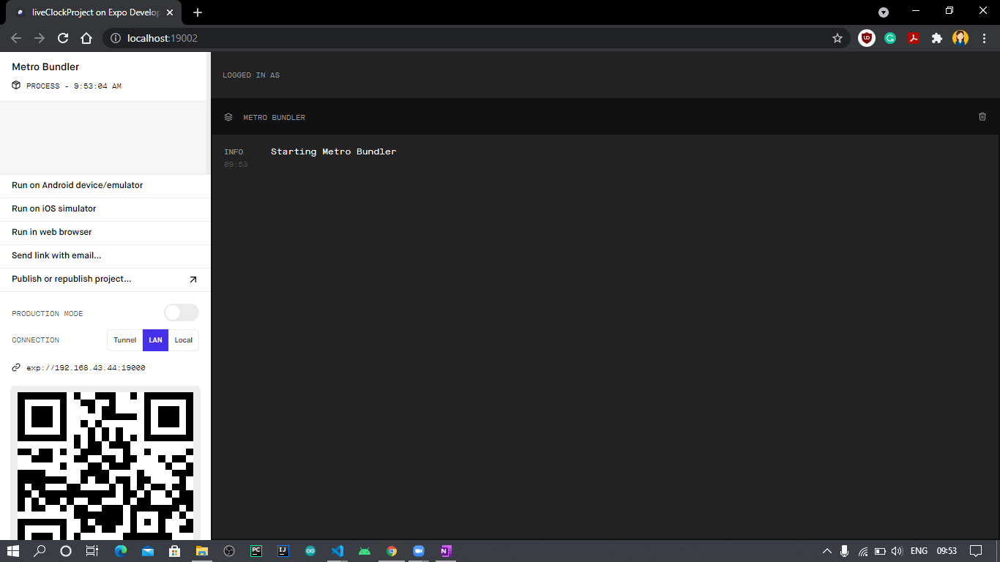
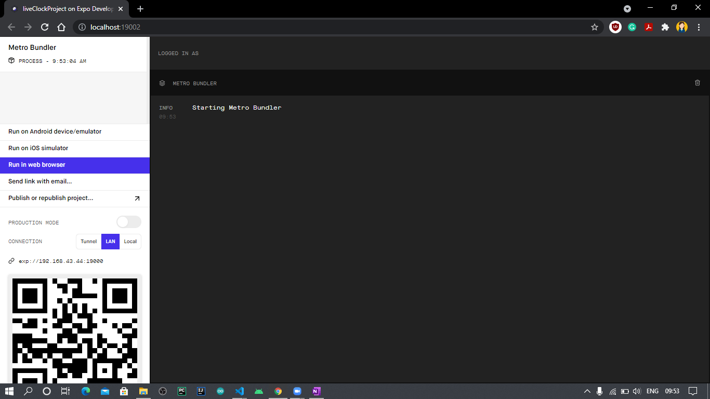
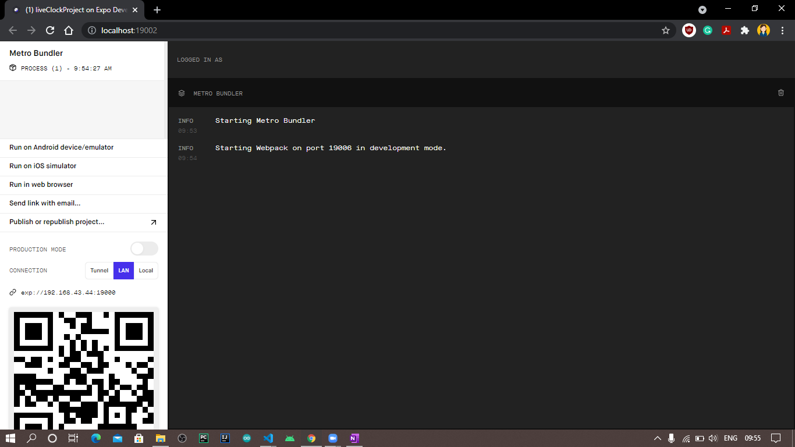
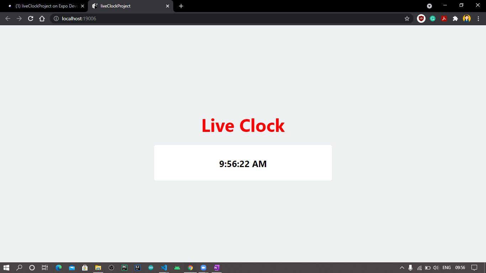

# Live Clock
A Live Clock Project which shows current time always with appropriate abbreviations AM or PM.

# Use of Project
A beginner-friendly project to get started with web development, especially React-Native. 

# Stack Used
- JavaScript
- React-Native

# Screenshots
- On running "npm start" command, a "Expo Developer Tools" window will open in the browser.

- On clicking "Run in Web Browser", project will start initializing.

- A new tab will open which will show the live clock.

